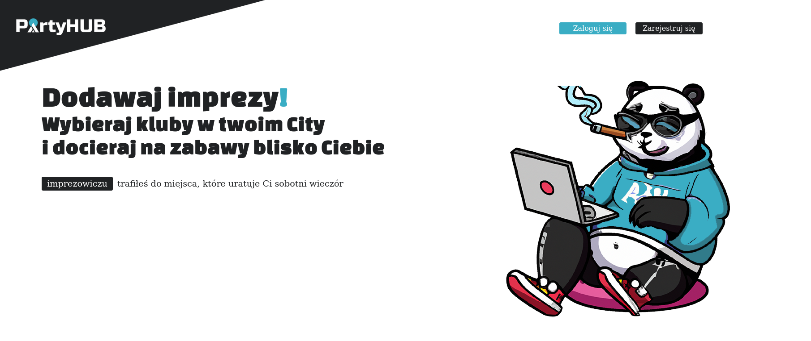

## Description
The project being the initiation of a social network site.

## Contains
- Leaflet API Autofill for city validation during registration process (backend and frontend side for certaintity of proper cities names being fullfilled)
- Foundations for work on sockets
- sails-disk 
- angular authguard and sails middleware(policy.js)

## Run dev
- start sails server
```
npm run start
```
-start ng app
```
ng serve --proxy-config ./src/proxy.conf.json
```
